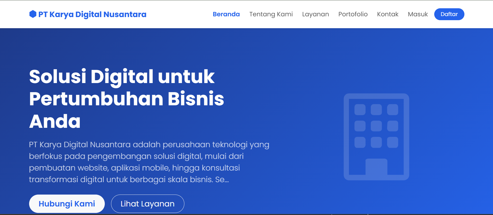
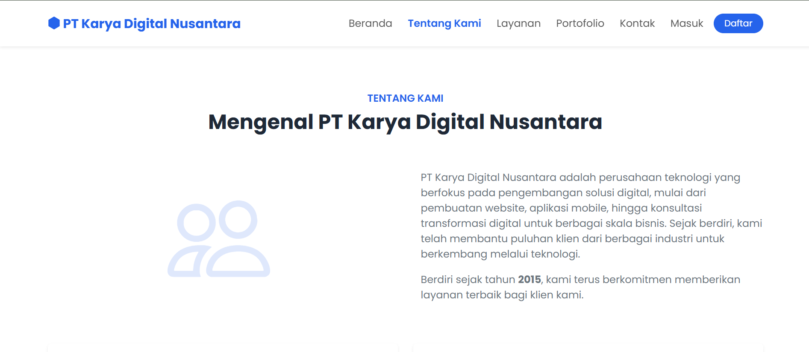
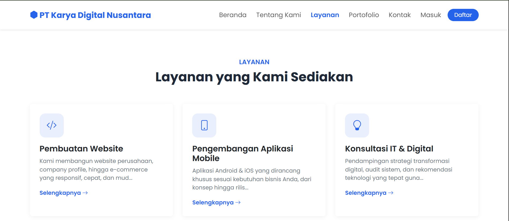
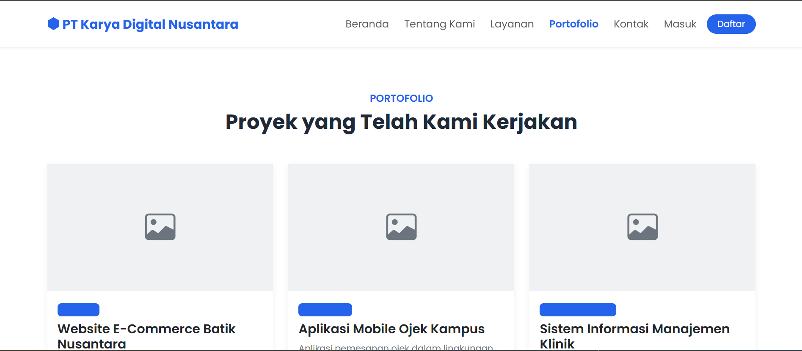
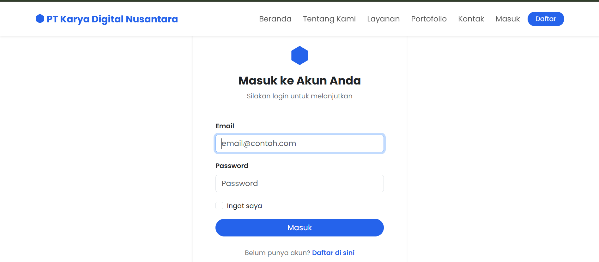
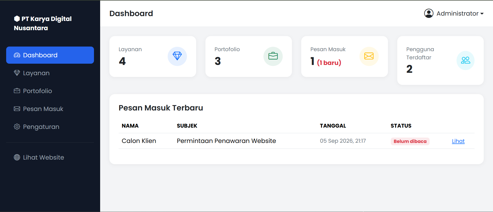

<div align="center">

# 🏢 Company Profile Website — Laravel

**Website profil perusahaan full-stack** dengan sistem autentikasi, panel admin, dan manajemen konten dinamis (CRUD), dibangun menggunakan Laravel & Blade.

[](https://php.net)
[](https://laravel.com)
[](https://sqlite.org)
[](https://getbootstrap.com)
[](LICENSE)

[Demo Live](#) · [Laporkan Bug](../../issues) · [Ajukan Fitur](../../issues)

</div>

---

## 📖 Tentang Project

Website ini adalah **studi kasus company profile** yang dibangun dari nol menggunakan Laravel, mencakup dua sisi sekaligus:

- **Sisi publik (frontend)** — halaman informasi perusahaan yang bisa diakses siapa saja
- **Sisi admin (backend/dashboard)** — panel privat untuk mengelola seluruh konten website tanpa perlu sentuh kode

Cocok dijadikan referensi/portofolio untuk menunjukkan kemampuan membangun aplikasi web full-stack dengan Laravel: routing, autentikasi, relational database, file upload, hingga proteksi akses berbasis role.

---

## ✨ Fitur

### 🌐 Halaman Publik
- **Beranda** — hero section, highlight layanan & portofolio terbaru
- **Tentang Kami** — visi, misi, dan profil perusahaan
- **Layanan** — daftar & detail layanan yang ditawarkan
- **Portofolio** — daftar & detail proyek/hasil kerja perusahaan
- **Kontak** — formulir kontak yang tersimpan langsung ke database
- Desain **responsive** (mobile-friendly) menggunakan Bootstrap 5

### 🔐 Autentikasi
- Registrasi & login pengguna (session-based, tanpa dependency tambahan)
- Sistem **role** — `admin` dan `user`
- Middleware proteksi khusus untuk area admin

### 🛠️ Panel Admin (`/admin`)
- **Dashboard** — ringkasan statistik (jumlah layanan, portofolio, pesan masuk, pengguna)
- **CRUD Layanan** — tambah, edit, hapus layanan lengkap dengan upload gambar & icon
- **CRUD Portofolio** — tambah, edit, hapus proyek lengkap dengan upload gambar
- **Manajemen Pesan Masuk** — lihat, tandai terbaca, dan hapus pesan dari formulir kontak
- **Pengaturan Profil Perusahaan** — ubah nama, tagline, visi-misi, alamat, kontak & sosial media langsung dari dashboard tanpa edit kode

---

## 📸 Screenshot

> _Tambahkan screenshot asli website Anda di sini setelah dijalankan secara lokal. Simpan gambar di folder `docs/screenshots/` lalu ganti path di bawah ini._

| Beranda | Tentang Kami |
|---|---|
|  |  |

| Layanan | Portofolio |
|---|---|
|  |  |

| Login | Dashboard Admin |
|---|---|
|  |  |

<details>
<summary>💡 Cara mengambil screenshot untuk README ini</summary>

1. Jalankan project secara lokal (`php artisan serve`)
2. Buka setiap halaman di browser, ambil screenshot (Windows: `Win + Shift + S`)
3. Buat folder `docs/screenshots/` di root project, simpan gambar di sana
4. Commit & push — gambar akan otomatis tampil di README GitHub

</details>

---

## 🧰 Teknologi yang Digunakan

| Kategori | Teknologi |
|---|---|
| **Backend Framework** | [Laravel 13](https://laravel.com) (PHP 8.5) |
| **Template Engine** | Blade (native Laravel, tanpa Livewire/Vue/React) |
| **Database** | SQLite |
| **Frontend Styling** | Bootstrap 5 + Bootstrap Icons (via CDN, tanpa build step) |
| **Font** | Google Fonts — Poppins |
| **Autentikasi** | Laravel Session Auth (native, tanpa package pihak ketiga) |
| **Arsitektur** | MVC (Model-View-Controller) |

---

## 🚀 Cara Instalasi

### Kebutuhan Sistem
- PHP >= 8.5
- Composer
- Ekstensi PHP: `pdo_sqlite`, `mbstring`, `openssl`, `fileinfo`

### Langkah-langkah

```bash
# 1. Clone repository
git clone https://github.com/AgiAgustianDavi/company-profile-laravel.git
cd company-profile-laravel

# 2. Install dependency PHP
composer install

# 3. Salin file environment
cp .env.example .env          # Windows CMD: copy .env.example .env

# 4. Generate application key
php artisan key:generate

# 5. Buat file database SQLite
touch database/database.sqlite               # Linux/Mac
# Windows PowerShell:
# New-Item database/database.sqlite -ItemType File

# 6. Jalankan migrasi & seeder (data contoh + akun admin)
php artisan migrate --seed

# 7. Buat symbolic link storage (agar gambar upload bisa diakses)
php artisan storage:link

# 8. Jalankan server lokal
php artisan serve
```

Buka **http://127.0.0.1:8000** di browser Anda. 🎉

### 🔑 Akun Default (dari seeder)

| Role  | Email                        | Password   |
|-------|-------------------------------|------------|
| Admin | `admin@karyadigital.test`     | `password` |
| User  | `user@karyadigital.test`      | `password` |

> ⚠️ **Untuk production**, segera ganti password akun default ini dan buat akun admin baru Anda sendiri.

---

## 📁 Struktur Folder

```
app/
├── Http/
│   ├── Controllers/          # Controller halaman publik & auth
│   ├── Controllers/Admin/    # Controller khusus panel admin
│   └── Middleware/           # AdminMiddleware (proteksi role)
└── Models/                   # User, Service, Portfolio, ContactMessage, Setting

database/
├── migrations/                # Struktur tabel database
└── seeders/                   # Data awal (akun admin + contoh konten)

resources/views/
├── layouts/                   # Layout frontend & admin
├── pages/                     # Halaman publik (home, about, services, dst)
├── auth/                      # Login & register
└── admin/                     # Halaman-halaman panel admin

routes/
└── web.php                    # Seluruh route aplikasi
```

---

## 🗺️ Roadmap / Pengembangan Selanjutnya

- [ ] Multi-bahasa (ID/EN)
- [ ] Testimoni klien (CRUD)
- [ ] Statistik pengunjung di dashboard
- [ ] Notifikasi email saat ada pesan masuk baru
- [ ] Export data pesan masuk ke Excel/PDF

---

## 🤝 Kontribusi

Kontribusi, isu, dan permintaan fitur sangat diterima!
Silakan buka [issue](../../issues) atau kirim [pull request](../../pulls).

## 📄 Lisensi

Project ini menggunakan lisensi [MIT](LICENSE) — bebas digunakan untuk keperluan belajar maupun pengembangan lebih lanjut.

---

<div align="center">

Dibuat dengan ❤️ menggunakan Laravel

</div>
